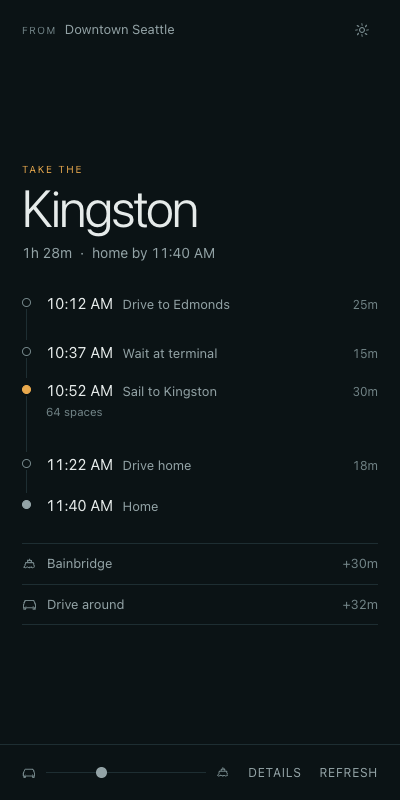
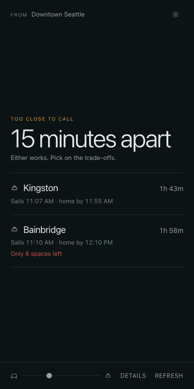

# Ferry Timer

Should I take the ferry, or drive around?

**Live: <https://ferrytimer.vercel.app>**

A small React PWA that answers that one question for the trip home to the Kitsap
Peninsula. It takes your current GPS position and your saved home address, then
compares three ways home using live traffic, live ferry schedules, and real-time
vessel positions.

| Route | Path |
| --- | --- |
| `BAINBRIDGE` | drive to Colman Dock → ferry → drive home |
| `KINGSTON` | drive to Edmonds → ferry → drive home |
| `DRIVE AROUND` | south around the sound via the Tacoma Narrows |

<p>
  
  
</p>

The result is either a single **clear winner** — the route named large, with a
journey rail below it whose segments are scaled to each leg's real duration — or
**too close to call** when the top two land within 15 minutes, which drops the
recommendation and lays out both options' trade-offs instead.

(Both shots are rendered against fixture data, not a real trip.)

Color is load-bearing rather than decorative: amber marks the recommendation and
the sailing itself, red marks a genuine problem (tight timing, nearly full car
deck), and everything else stays monochrome. A calm screen means nothing needs
your attention.

## How the estimate works

All of this lives in [`src/hooks/useRouteCalculation.ts`](src/hooks/useRouteCalculation.ts).

- **Drive legs** come from the Google Routes API with `TRAFFIC_AWARE` routing.
- **Real-time delay adjustment.** If a vessel reports an ETA it isn't docked
  yet, so that sailing's realistic departure becomes `ETA + 15 min` of loading
  time. The later of scheduled and estimated departure wins.
- **Boarding buffer.** You need to arrive 10 minutes before departure to count
  as making the boat. Sailings that depart inside that window are recorded as
  *missed* and shown in the details view.
- **Risk scoring** on two axes, combined into an overall level:
  - *timing* — under 10 min of buffer is high, under 20 is medium
  - *space* — under 10 drive-up spaces left is high, under 30 is medium
- **Ferry preference bias.** The car-to-ferry slider in the footer adds 0–30 minutes to
  the drive-around option, so you can say how much extra driving you'd tolerate
  to take the boat instead. It biases the recommendation only — displayed times
  stay honest.

### Degraded data

Upstream services fail sometimes, so no single one can blank the screen:

- Sailing space and vessel positions are refinements. If they're unavailable the
  route is still calculated, just without space warnings or delay adjustment.
- If a route's drive times or schedule can't be fetched, only that route drops
  out and a warning names it. The rest still compare.
- Only when every route fails do you get a hard error.

## Data sources

- [WSDOT Ferries API](https://www.wsdot.wa.gov/ferries/api/) — `scheduletoday`,
  `terminalsailingspace`, `vessellocations`. Note it returns .NET-style
  `/Date(1234567890000-0800)/` timestamps, parsed in
  [`src/api/ferries.ts`](src/api/ferries.ts).
- Google Routes API and Google Geocoding API.

Both keys are **server-side only**. The browser only ever talks to this app's own
`/api/*` endpoints, which attach the keys and proxy upstream.

Those endpoints spend real quota, so [`api/_guard.ts`](api/_guard.ts) restricts
them to same-origin requests and rate limits per IP — 40/min for the billed
Google endpoints, 90/min for the free WSDOT ones. It's a brake on casual abuse,
not a precise global quota (each serverless instance counts separately); the
hard ceiling is the budget cap on the Google key itself.

## Setup

```bash
npm install
cp .env.local.example .env.local   # then fill in both keys
npm run dev
```

Get a WSDOT key at <https://www.wsdot.wa.gov/traffic/api/> and a Google Maps key
with the Routes and Geocoding APIs enabled.

| Command | What it does |
| --- | --- |
| `npm run dev` | Vite dev server; `/api/*` is proxied to upstream with keys injected |
| `npm run build` | `tsc` type-check then production build to `dist/` |
| `npm run preview` | Serve the built bundle locally |

In dev builds only, a button in the footer swaps your GPS position for a
fixed test location (Northgate, SeaTac, Downtown, U District, Bellevue) so route
logic can be exercised from a desk. That UI is compiled out of production
builds.

## Deployment

Deployed at <https://ferrytimer.vercel.app>, built from `main` on push and
configured in [`vercel.json`](vercel.json). The two environments reach
upstream by different mechanisms that must be kept in sync:

- **Production** — the serverless handlers in [`api/`](api/), one flat file per
  endpoint, reading `WSDOT_API_KEY` and `GOOGLE_MAPS_API_KEY` from Vercel env
  vars.
- **Development** — the `server.proxy` rules in
  [`vite.config.ts`](vite.config.ts), which build the same upstream URLs from
  `.env.local`.

Adding or changing an endpoint means changing it in both places.

## Layout

```
api/               Vercel serverless proxies (one file per upstream endpoint)
src/
  api/ferries.ts   WSDOT client — schedules, sailing space, vessel positions
  api/routes.ts    Google Routes + geocoding client
  hooks/           useRouteCalculation — the comparison logic
  components/      Settings (home address, bias), RouteDetails (leg breakdown)
  App.tsx          Recommendation and close-call rendering
```
